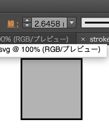
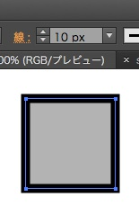

# Inkscape Good Template

Illustrator CS6 ***can not*** open exactly some svgs.

## Download

[default.xx.svg](default.xx.svg)

Please replace xx to your language and move to `~/.config/inkscape/templates/`.

## Why can not?
***[stroke_bad.svg](stroke_bad.svg)***

    <svg width="600" height="600" viewBox="0 0 158.75 158.75"...

When you drew 10px width stroke rectangle to stroke_bad.svg by Inkscape.

    <rect style="stroke-width:2.64583325...

2.64583325 is nearly equal 158.75 / 600 * 10.

On Illustrator CS6.

Too narrow !

***[stroke_good.svg](stroke_good.svg)***

    <svg width="600" height="600" viewBox="0 0 600 600"...
    ...
    <rect style="stroke-width:10...

Correct.  
**Your svg should be `viewBox="0 0 {width} {height}"`.**  
If you change default units (px, pt, mm, etc. ), viewBox will be changed.

